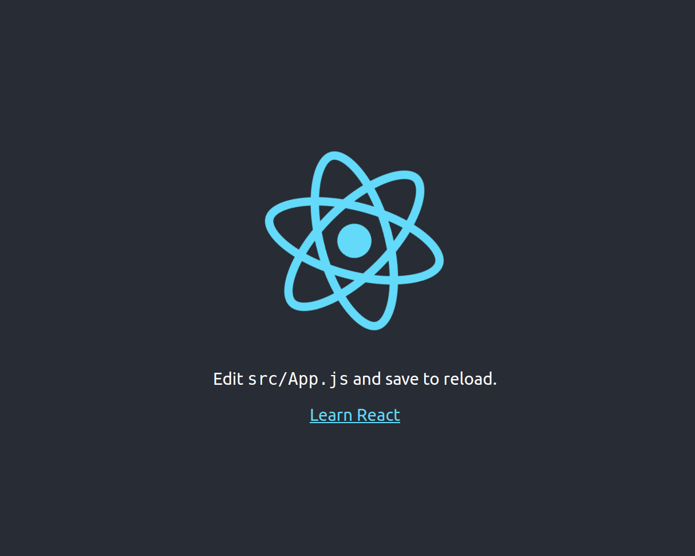

# Conceitos aprendidos na aula 01

## Criando um projeto
Para criar um projeto em react basta simplesmente executar o seguinte comando
```bash
    npx create-react-app <nome-do-projeto>
```
O comando acima cria um projeto genérico em React que ao executar o comando `npm start` usa uma porta local e exibe a seguinte imagem:
<div align=center>
    
</div>